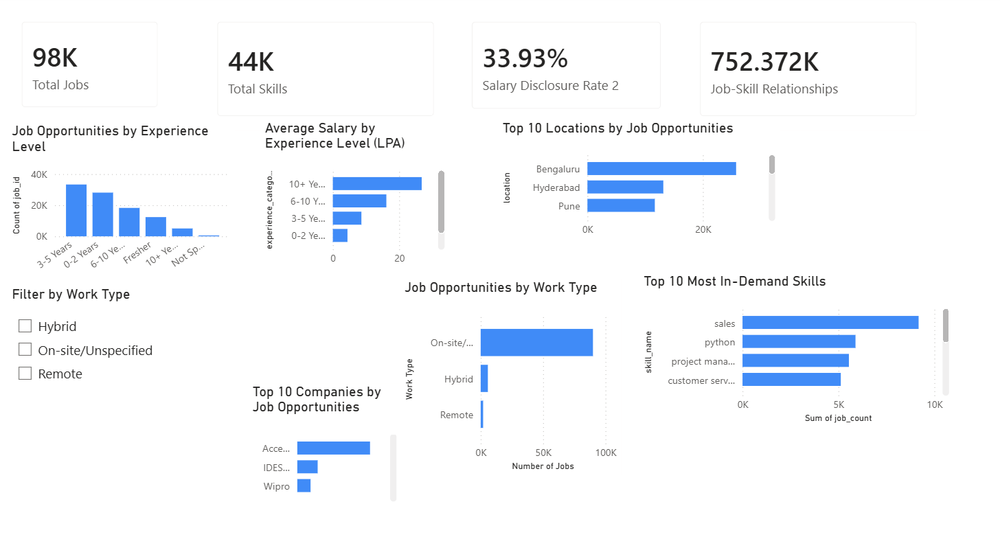
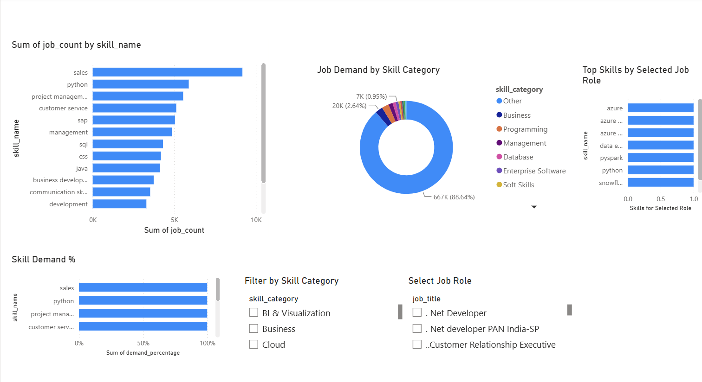
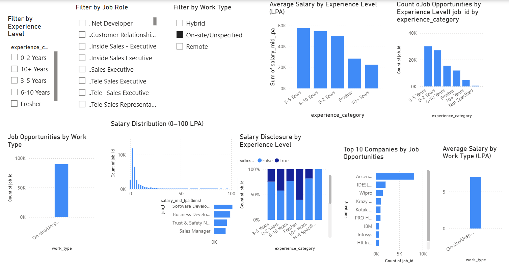
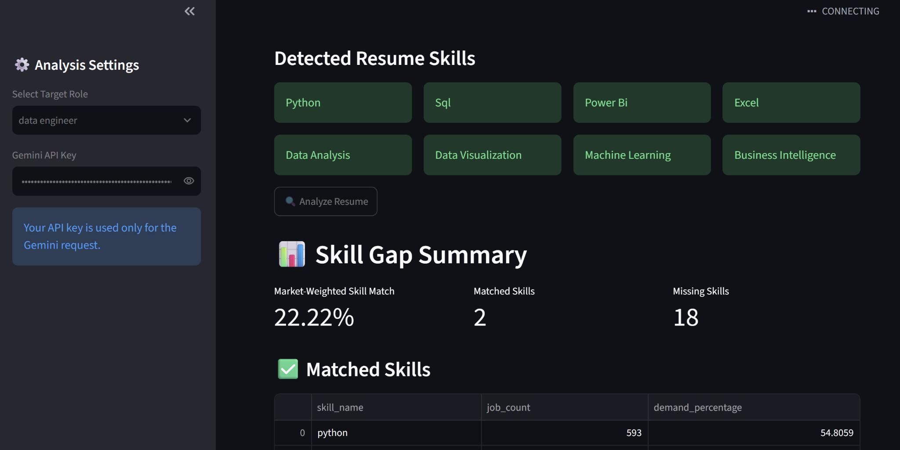

# AI-Powered Job Market Intelligence Platform

An end-to-end data analytics and AI application that analyzes job-market trends, identifies in-demand skills, and compares a candidate's resume with market requirements for a selected job role.

## Project Overview

The platform combines job-market data analysis, structured data modeling, Power BI visualization, resume skill-gap analysis, and Generative AI.

## Workflow

```text
Job Market Data
      ↓
Data Cleaning & Processing
      ↓
Structured Data Model
      ↓
Skill Demand Analysis
      ↓
Power BI Dashboard
      ↓
Resume Skill Extraction
      ↓
Skill Gap Analysis
      ↓
Gemini AI Recommendations
```

## Key Features

- Job-market trend analysis
- In-demand skill identification
- Job opportunities by location
- Experience-level analysis
- Salary analysis
- Work-type analysis
- Top company analysis
- Role-specific skill analysis
- Resume skill extraction from PDF
- Market-weighted skill matching
- Missing-skill identification
- Skill-learning recommendations
- AI-generated career analysis

## Technology Stack

- Python
- Pandas
- NumPy
- SQL / Relational Data Modeling
- Power BI
- Streamlit
- Google Gemini API
- PyPDF2
- Jupyter / Google Colab
- Git & GitHub

## Dataset

The project uses an Indian job-market dataset containing approximately 97K unique job postings.

Processed data is organized into:

- `jobs.csv` — Job-level information
- `skills.csv` — Skill master data
- `job_skills.csv` — Job-to-skill relationships
- `locations.csv` — Location master data
- `job_locations.csv` — Job-to-location relationships
- `skill_demand.csv` — Aggregated skill-demand metrics

## Data Model

```text
Jobs
 ├── Job_Skills ─── Skills
 │
 └── Job_Locations ─── Locations
```

## Project Metrics

The processed dataset contains:

| Metric | Value |
|---|---:|
| Unique Job Postings | 97,679 |
| Skills Identified | 44,005 |
| Job-Skill Relationships | 752,372 |
| Locations | 1,947 |
| Job-Location Relationships | 131,198 |
| Salary Disclosure Rate | 33.93% |

These metrics are calculated from the processed Indian job-market dataset included in the repository.

## Key Analytical Insights

The platform supports analysis of:

- Most in-demand technical and business skills
- Skill demand by job role
- Skill demand by category
- Job opportunities by location
- Experience-level job distribution
- Work-type distribution
- Salary patterns across experience levels
- Company-level job opportunity distribution
- Role-specific skill requirements
- Resume-to-market skill matching
- Missing-skill identification and learning recommendations

## Example Market Findings

Among the processed job postings, frequently observed skills include:

- Sales
- Python
- Project Management
- Customer Service
- SAP
- Management
- CSS
- Java
- SQL
- Business Development

The platform can also filter the analysis by specific roles such as Data Analyst and Data Engineer to identify role-specific skill requirements.

## Resume Skill Gap Analyzer

The Streamlit application allows a user to:

1. Select a target job role.
2. Upload a resume in PDF format.
3. Extract relevant resume skills.
4. Compare resume skills with market-demanded skills.
5. Calculate a market-weighted skill match percentage.
6. Identify missing skills.
7. Generate prioritized recommendations.
8. Generate AI-powered career analysis using Gemini.

## Power BI Dashboard

The project includes the complete Power BI dashboard used for interactive job-market analysis.

The dashboard contains:

- Market Overview
- Skill Intelligence
- Role & Skill Intelligence
- Job opportunity analysis
- Experience-level analysis
- Salary analysis
- Work-type analysis
- Top company analysis
- Skill demand analysis
- Role-specific skill analysis

The Power BI source file is available at:

`powerbi/Job_Market_Intelligence_Dashboard.pbix`

Open the `.pbix` file using Microsoft Power BI Desktop to explore the complete dashboard and data model.

## AI Analysis

Google Gemini is used as the Generative AI layer.

The AI receives structured information from the analytics pipeline, including the target role, matched skills, missing skills, and market-based recommendations.

The AI generates:

- Skill profile analysis
- Missing-skill explanations
- Learning roadmap
- Practical project suggestions
- Action plan

API keys are entered at runtime and are not stored in the repository.

## Running the Application

### 1. Clone the repository

```bash
git clone https://github.com/rahulpakalapati45-sketch/AI-Job-market-intelligence-platform.git
cd ai-job-market-intelligence-platform
```

### 2. Install dependencies

```bash
pip install -r requirements.txt
```

### 3. Run Streamlit

```bash
streamlit run app.py
```

### 4. Use Gemini AI

Enter a valid Google Gemini API key in the application.

## Project Structure

```text
ai-job-market-intelligence-platform/
│
├── app.py
├── requirements.txt
├── .gitignore
├── README.md
├── final_candidate_report.json
│
├── powerbi/
│   └── rahul.pbix
│
└── data/
    ├── jobs.csv
    ├── job_skills.csv
    ├── job_locations.csv
    ├── locations.csv
    ├── skill_demand.csv
    └── skills.csv
```

## Example Use Case

A student targeting a Data Analyst role can upload their resume and receive market-relevant skill requirements, matched skills, missing skills, demand information, prioritized recommendations, and AI-generated career guidance.

## Project Objective

The objective is to demonstrate how data engineering, analytics, visualization, and Generative AI can be combined into a practical decision-support application for career and job-market intelligence.

## Future Enhancements

- Automated job-data collection through APIs
- Scheduled dataset updates
- Advanced NLP-based skill extraction
- Job recommendation engine
- Resume ranking against individual job descriptions
- Cloud deployment
- Automated Power BI dataset refresh
- Additional AI-powered career insights

## Disclaimer

Market statistics and recommendations are based on the dataset included with this project and should be interpreted within the scope and coverage of that dataset.

## Dashboard Screenshots

### Power BI — Market Overview

The Market Overview dashboard summarizes job-market volume, experience levels, salary information, work arrangements, locations, companies, and in-demand skills.



### Power BI — Skill Intelligence

The Skill Intelligence dashboard analyzes skill demand across categories and supports filtering by skill category and job role.



### Power BI — Role & Skill Intelligence

This dashboard provides role-level analysis including experience, salary, work type, company opportunities, and role-specific skill demand.



### Streamlit — Resume Skill Gap Analyzer

The Streamlit application extracts skills from a candidate's resume, compares them with market requirements for the selected role, identifies missing skills, and provides AI-powered career analysis using Gemini.



